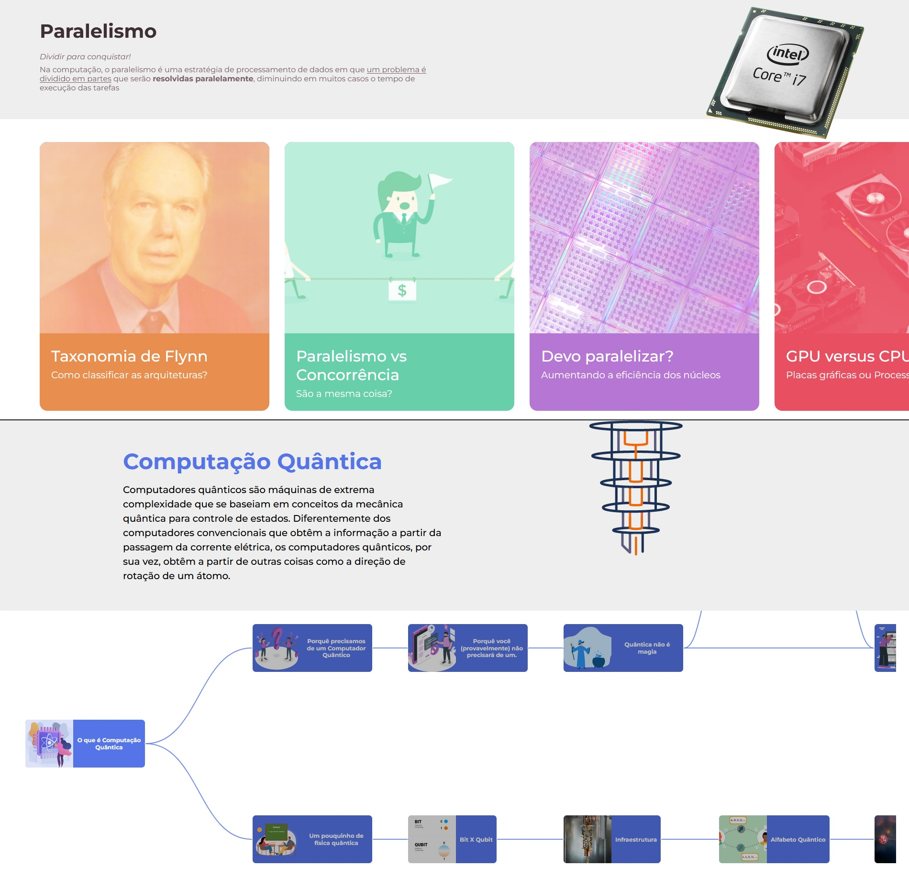

# 💻 Processamento de Dados
Data Processing is E-learning application to teach a little bit about data processing. [Access Now](https://processamento-de-dados.vercel.app)
 
<h1 align="center">
    
</h1>

## 🎯 Purpose
Project developed to meet the demands of Computers Architecture II discipline.

## :rocket: Technologies
- [NextJs](https://nextjs.org)
- [TypeScript](https://www.typescriptlang.org/)


## Getting Started

Download the project dependencies.

```bash
npm install
# or
yarn
```

Then, run the development server:

```bash
npm run dev
# or
yarn dev
```

Open [http://localhost:3000](http://localhost:3000) with your browser to see the result.
